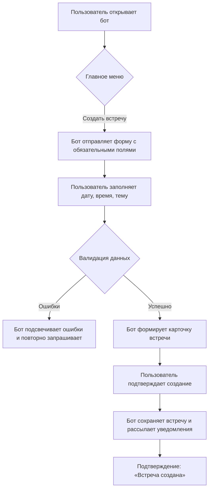
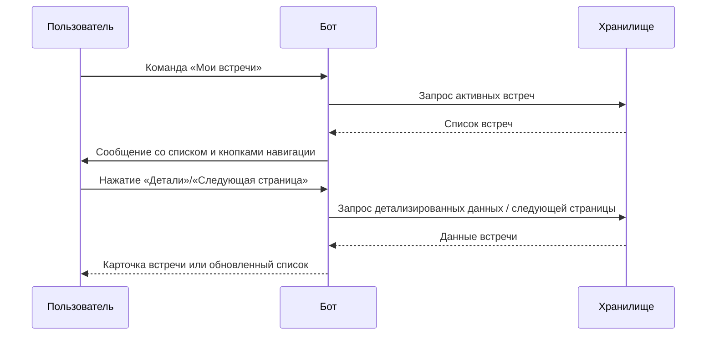
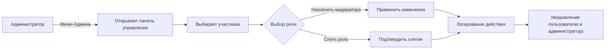

# Slonyara Bot Interaction Guide

## 1. Сценарии взаимодействия

### 1.1 Создание встречи


### 1.2 Просмотр списка встреч


### 1.3 Управление ролями


## 2. Шаблон сообщений бота

> Все сообщения оформляются в формате Markdown. Для ключевых статусов используются эмодзи цвета статуса.

| Тип сообщения | Заголовок | Тело | Кнопки |
| ------------- | --------- | ---- | ------ |
| Успешное действие | `🟢 **Готово!**` | Описание результата, список ключевых полей в формате `• Поле: Значение`. | «Вернуться в меню», «Открыть встречу» |
| Ошибка/предупреждение | `🟠 **Проверьте данные**` или `🔴 **Ошибка**` | Текст ошибки с подсветкой проблемных полей в блоке ```diff``` | «Изменить данные», «Отменить» |
| Информационное уведомление | `🔵 **Напоминание**` | Краткий текст + блок цитаты `> Детали` | «Открыть расписание», «Позже» |

**Пример:**
```
🟢 **Готово!**

• Тема: Обсуждение релиза
• Дата: 12.05.2024 15:00
• Участники: 5

[Вернуться в меню] [Открыть встречу]
```

## 3. Команды и кнопки

### 3.1 Главное меню
- `/start` — приветствие и вывод главного меню.
- `Создать встречу` — запуск сценария создания встречи.
- `Мои встречи` — просмотр списка активных встреч.
- `Помощь` — краткая справка и FAQ.

### 3.2 Админ-панель
- `Управление ролями` — список пользователей с ролями.
- `Рассылка` — отправка объявления всем пользователям.
- `Статистика` — просмотры, активные встречи, модераторы.
- `Настройки бота` — конфигурация расписания, интеграций.

### 3.3 Справка и настройки
- `/help` — текстовая справка по командам.
- `FAQ` — навигация по часто задаваемым вопросам.
- `Обратная связь` — форма для связи с поддержкой.
- `Настройки уведомлений` — выбор каналов и частоты.
- `Язык интерфейса` — переключение языка.

## 4. Рекомендации по реализации
- Использовать инлайн-кнопки для действий внутри карточек встреч.
- Для длинных списков применять пагинацию с кнопками «‹ Назад» и «Далее ›».
- Логировать действия администраторов для отслеживания изменений ролей.

